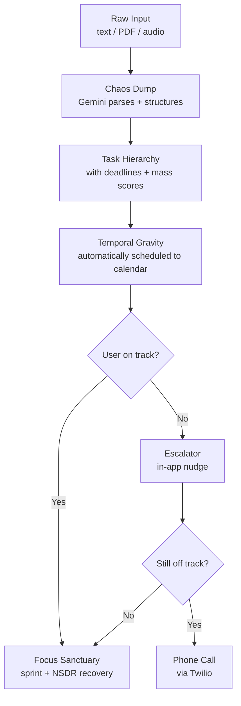
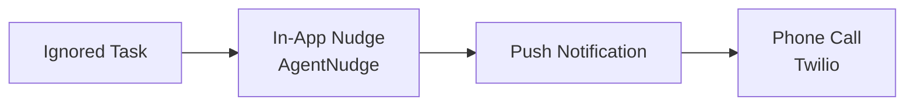
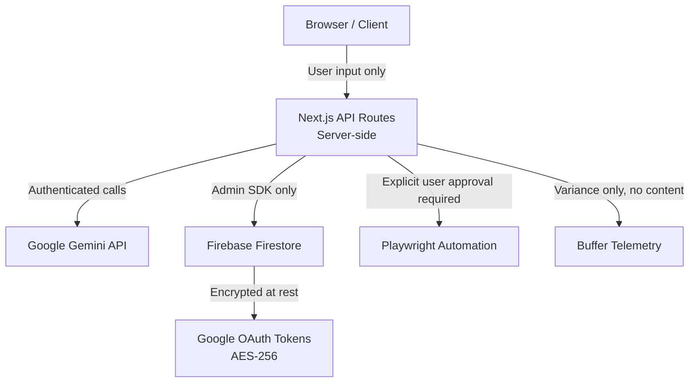

# VibeShift AI

VibeShift is an agentic productivity operating system powered by Google Gemini 2.0 Flash. It is not a to-do list. It extracts tasks from raw input, schedules them with behavioral intelligence, and physically intervenes when you go off track.

Built for the **Vibe2Ship** hackathon (CodingNinjas x Google for Developers), 2026.

[](https://nextjs.org)
[](https://react.dev)
[](https://www.typescriptlang.org)
[](https://tailwindcss.com)
[](./LICENSE)

---

## How it works



---

## Features

### Chaos Dump

Accepts raw text walls, PDFs, syllabi, invoices, and live meeting transcripts. Gemini parses the input and generates a structured task hierarchy with deadlines. Implemented in `ChaosDumpModal`.

### Temporal Gravity

Every task receives a mass score derived from urgency and importance. High-mass tasks are injected into Google Calendar and resist displacement. Visualized in `TemporalGravityVisualizer`.

### The Escalator

A graduated intervention system triggered when tasks are ignored:



### Shadow Schedule

Analyzes 30 days of behavioral telemetry to predict task overruns. Silently injects buffer time into the calendar to prevent cascading failures. Implemented in `ShadowScheduleOverlay`. Only timing variance is tracked, never task content.

### Focus Sanctuary

Sprint mode (Pomodoro-style) that blocks distractions. Paired with NSDR (Non-Sleep Deep Rest) recovery sessions. Implemented in `FocusSanctuaryDashboard`.

### AI Ghost Drafts

Pre-drafts emails such as reschedule requests and meeting summaries before you realize you need them, by scanning upcoming calendar events and email context via the Gmail API. Implemented in `GhostDraftsWidget`.

### One-Click Delegation Engine

Generates browser automation plans via Playwright hooks. Requires explicit user approval before any external action is executed. The AI never acts unilaterally on external systems.

### Buffer Insights

Surfaces predicted overruns from historical variance data. Implemented in `BufferInsightsWidget`.

---

## Tech stack

| Layer | Technology |
| --- | --- |
| Framework | Next.js 16.2.9, App Router |
| Language | TypeScript 5 |
| Styling | Tailwind CSS v4, Memphis Design System |
| Animations | Framer Motion |
| Icons | Lucide React |
| State management | Zustand |
| Auth and database | Firebase (Auth + Firestore) |
| AI / LLM | Google Gemini 2.0 Flash via @google/genai |
| Integrations | Google Calendar API, Gmail API, Twilio, Playwright (mocked) |
| Fonts | Space Grotesk, JetBrains Mono via next/font/google |

---

## Project structure

```mermaid
graph TD
    src --> app
    src --> components
    src --> context
    src --> hooks
    src --> lib
    src --> services
    src --> store
    src --> types
    src --> workers

    app --> page["page.tsx (landing)"]
    app --> layout["layout.tsx (root)"]
    app --> globals["globals.css (design system)"]
    app --> auth["auth/ (sign in)"]
    app --> dashboard["dashboard/ (command center)"]
    app --> sanctuary["sanctuary/ (focus mode)"]
    app --> api["api/ (server routes)"]

    components --> cmd["CommandCenterDashboard"]
    components --> chaos["ChaosDumpModal"]
    components --> tgv["TemporalGravityVisualizer"]
    components --> fsd["FocusSanctuaryDashboard"]
    components --> sso["ShadowScheduleOverlay"]
    components --> ghd["GhostDraftsWidget"]
    components --> biw["BufferInsightsWidget"]
    components --> an["AgentNudge"]
    components --> edw["EscalatorDemoWidget"]
    components --> dho["DistractionHijackOverlay"]
    components --> sb["Sidebar"]
    components --> te["TaskEngine"]
```



---

## Security model



| Concern | Approach |
| --- | --- |
| AI isolation | All Gemini calls run server-side in API routes, never in the browser |
| Delegation gate | Playwright tasks require explicit approval before execution |
| Token storage | Google OAuth tokens are AES-256 encrypted before writing to Firestore |
| Telemetry | Buffer analysis tracks timing variance only, never raw task content |
| Secrets | All API keys and credentials live in `.env.local`, never committed |

---

## Local setup

### Prerequisites

| Requirement | Notes |
| --- | --- |
| Node.js 20+ | Required |
| Firebase project | Free tier is sufficient |
| Google Cloud project | Calendar API and Gmail API must be enabled |
| Gemini API key | From https://aistudio.google.com/apikey |
| Twilio account | Optional, needed only for phone call escalations |

### Steps

1. Clone the repository.

```bash
git clone https://github.com/tanushbhootra/vibeshift.git
cd vibeshift
```

2. Install dependencies.

```bash
npm install
```

3. Create the environment file.

```bash
cp .env.local.example .env.local
```

Open `.env.local` and fill in all required values. See `.env.local.example` for descriptions of each variable.

4. Start the development server.

```bash
npm run dev
```

Open [http://localhost:3000](http://localhost:3000) in your browser.

---

## Environment variables

See [`.env.local.example`](./.env.local.example) for the full annotated list.

| Variable | Required | Description |
| --- | --- | --- |
| `NEXT_PUBLIC_FIREBASE_API_KEY` | Yes | Firebase client API key |
| `NEXT_PUBLIC_FIREBASE_PROJECT_ID` | Yes | Firebase project ID |
| `GOOGLE_AI_API_KEY` | Yes | Gemini API key |
| `GOOGLE_CLIENT_ID` | Yes | Google OAuth client ID |
| `GOOGLE_CLIENT_SECRET` | Yes | Google OAuth client secret |
| `NEXTAUTH_SECRET` | Yes | Random 32-byte secret for NextAuth |
| `ENCRYPTION_KEY` | Yes | 32-byte AES-256 key for token encryption |
| `UPSTASH_REDIS_REST_URL` | Recommended | Edge rate limiting |
| `UPSTASH_REDIS_REST_TOKEN` | Recommended | Edge rate limiting |

---

## Available scripts

| Command | Description |
| --- | --- |
| `npm run dev` | Start development server on localhost:3000 |
| `npm run build` | Build production bundle |
| `npm run start` | Start production server |
| `npm run lint` | Run ESLint |

---

## License

MIT. See [LICENSE](./LICENSE) for details.

Built at Vibe2Ship 2026.
